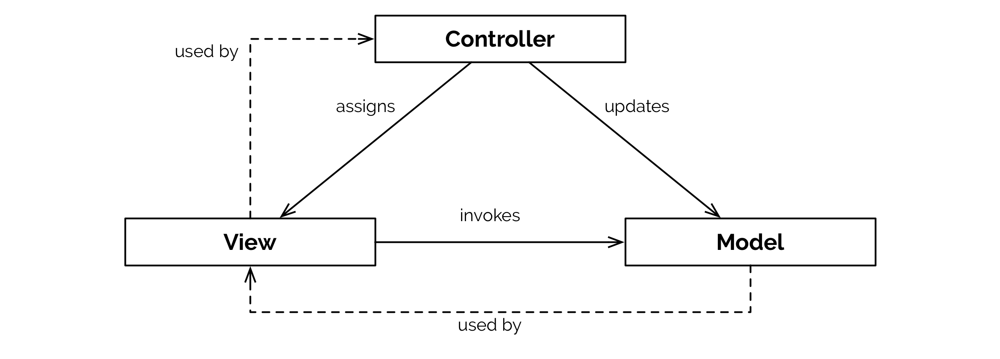

# PHP Basics: Car dealer exercises

The following repository contains possible outcome of the provided exercises:

* step-0: Hello World example
* step-1: Car domain model
* step-2: Namespaces and class files
* step-3: PSR-4 Composer refactoring
* step-4: MVC refactoring

It's possible to checkout each state locally using Git by selecting the
according step as branch name. The following example switches to `step-1`.

```
git checkout step-1
```

# Exercise for this step



**Tasks**

* separate concerns by introducing the proper model-view-controller (MVC) pattern
* instead of using `echo` directly in `CarView`, concatenate the HTML result and return the string
* move the code of `index.php` to a new `CarController` class in namespace `MasterSE\CarDealer\Controller`

### Adjusted CarView.php

``` {.php .numberLines}
<?php
namespace MasterSE\CarDealer\View;

class CarView
{
	public function renderMultiple(array $cars): string
	{
		$content = '';
		// @todo implement the rest of the output
		// foreach ($cars as $car)
		return $content;
	}

	public function renderSingle(Car $car): string
	{
		$content = '';
		$content .= '<ul>';
		$content .= '<li>Brand: ' . $car->getBrand()->getName() . '</li>';
		// @todo implement the rest of the output
		$content .= '/<ul>';
	}
}
```

### Parts of new CarController.php

``` {.php .numberLines}
<?php
namespace MasterSE\CarDealer\Controller;

class CarController
{
	private $factory;
	private $view;

	public function __construct(CarFactory $factory, CarView $view)
	{
		$this->factory = $factory;
		$this->view = $view;
	}

	public function listAction(): string
	{
		$cars = $this->factory
			->createMultiple($this->retrieveData());
		return $this->view
			->renderMultiple($cars);
	}

	private function retrieveData(): array
	{
		return [
			// ...
		];
	}
}
```

### Adjusted index.php

The instances of `CarFactory` and `CarView` and handed over (manually injected) to the `CarController`.

``` {.php .numberLines}
<?php
$controller = new \MasterSE\CarDealer\Domain\Model\CarController(
	new \MasterSE\CarDealer\Domain\Model\CarFactory(),
	new \MasterSE\CarDealer\View\CarView()
);
echo $controller->listAction();
```